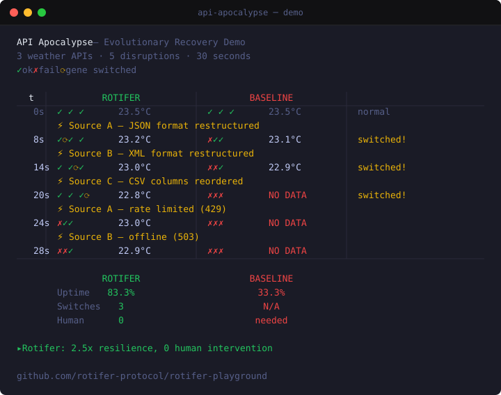

# API Apocalypse — Evolutionary Recovery Benchmark

> When APIs break, evolutionary agents recover. Traditional agents don't.

<p align="center">
  
</p>

## What This Proves

Rotifer Protocol's core thesis: **agents equipped with competing genes and fitness-based auto-failover recover from API disruptions autonomously**, while traditional fixed-code agents stay broken until a human fixes them.

## The Experiment

A weather data aggregation agent pulls temperature readings from 3 API sources every 2 seconds. Over 3 minutes, the APIs undergo 5 disruptions:

| Time | Disruption | Source |
|------|-----------|--------|
| t=30s | JSON response restructured | Source A |
| t=60s | XML format changed | Source B |
| t=90s | CSV columns reordered | Source C |
| t=120s | Rate limiting (429) | Source A |
| t=150s | Complete outage (503) | Source B |

### Two Agents, Same Task

- **Rotifer Agent** (experiment): 6 genes across 3 domains (2 per source), with L2 fitness-driven auto-failover
- **Baseline Agent** (control): 3 fixed parsers, no failover capability

## Try It Yourself

```bash
# 30-second condensed demo (terminal)
cd rotifer-playground
npx tsx experiments/api-apocalypse/demo.ts

# Full 3-minute experiment with results export
npx tsx experiments/api-apocalypse/run.ts
```

Results are saved to `experiments/api-apocalypse/results/`.

## Architecture

```
mock-server.ts              ← 3 API endpoints with chaos injection schedule
genes/
  weather-source-a-v1/      ← Parses { temperature, city, unit }
  weather-source-a-v2/      ← Parses { weather: { temp_celsius } }
  weather-source-b-v1/      ← Parses <weather><temperature>N</temperature></weather>
  weather-source-b-v2/      ← Parses <temp celsius="N"/>
  weather-source-c-v1/      ← Parses city,temperature,unit CSV
  weather-source-c-v2/      ← Parses location,unit,value CSV
rotifer-agent.ts            ← Experimental group: auto-failover
baseline-agent.ts           ← Control group: fixed code
run.ts                      ← Experiment orchestrator
demo.ts                     ← 30-second condensed demo
generate-svg.ts             ← SVG animation generator (demo.svg)
```

## Core Innovation

The `RotiferAgent.tick()` method implements **domain-level fitness-ordered failover**:

1. Call the active gene for each source
2. If it fails → penalize its fitness score
3. Query same-domain genes sorted by fitness
4. Try the next-best candidate
5. If it succeeds → promote it to active, reward its fitness

This is the L2 Calibration auto-failover mechanism specified in the Rotifer Protocol but not previously implemented at runtime.

## License

Apache-2.0 — Part of [Rotifer Protocol](https://rotifer.dev)
